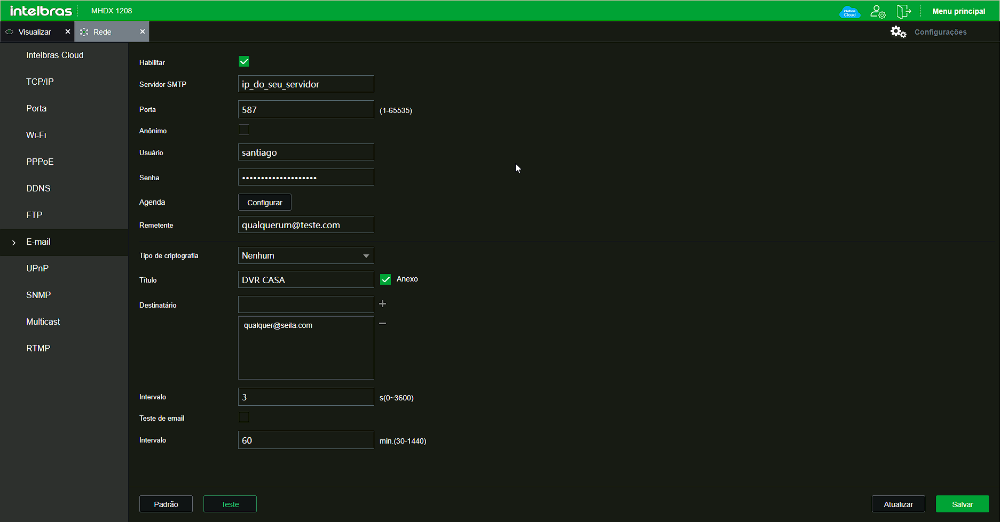
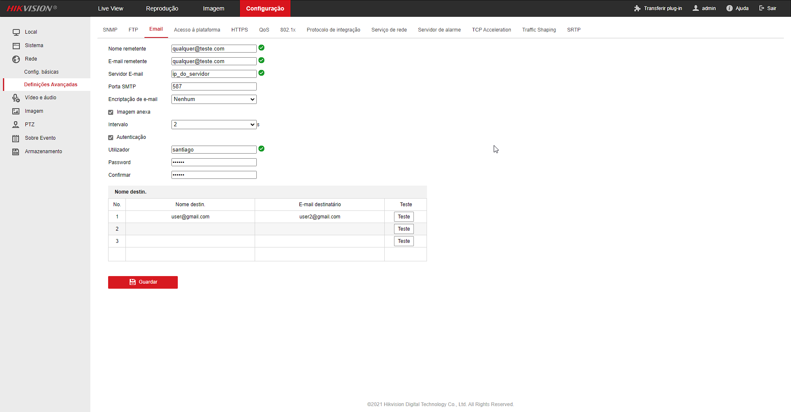

# SMTP para Telegram (NVR, DVR, CAM)

<!---Esses são exemplos. Veja https://shields.io para outras pessoas ou para personalizar este conjunto de escudos. Você pode querer incluir dependências, status do projeto e informações de licença aqui--->

> Script simples para NodeJs para receber imagens (dvr, nvr, câmeras CFTV) e enviar para o Telegram (Chat, grupo ou canal).

### Ajustes e melhorias

O projeto ainda está em desenvolvimento e as próximas atualizações serão voltadas nas seguintes tarefas:

- [x] Melhoria na velocidade de envio 
- [ ] Upload da imagem para alguma API (Google Drive, SkyDrive, etc)

## 💻 Pré-requisitos

Antes de começar, verifique se você atendeu aos seguintes requisitos:
<!---Estes são apenas requisitos de exemplo. Adicionar, duplicar ou remover conforme necessário--->
* NodeJS
* fs, https, smtp-server, mailparser e telegraf
> Qualquer modelo de câmera ou dvr, que envie Emails é compatível.

## 💻 Configuração de Email

* Como exemplo foi utilizada a porta 587
* A conta e senha devem ser modificados no script
* Para obter o token e o chat id do Telegram -> https://core.telegram.org/bots/api

> Exemplo Intelbras

> Exemplo HikVision

## 📝 Licença

Esse projeto está sob licença. Veja o arquivo [LICENÇA](LICENSE.md) para mais detalhes.

## 💻 Feito com
* NodeJS

[⬆ Voltar ao topo](#smtp_dvr_telegram) 
